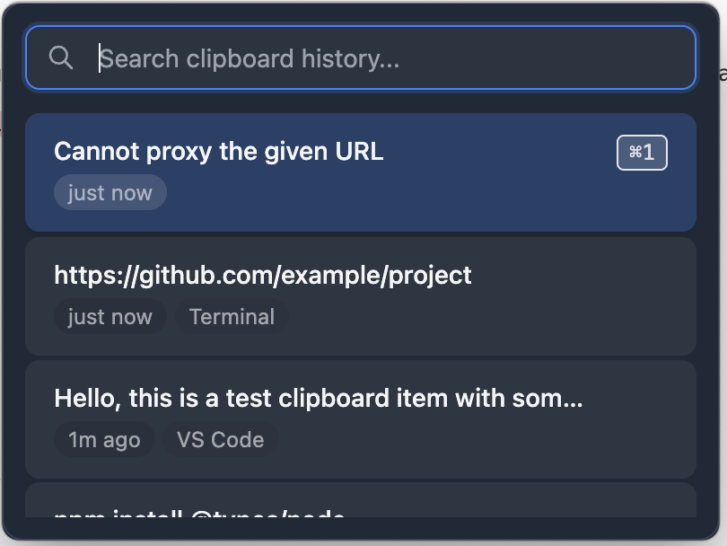

# CeeVee

> **Minimal. Fast. Invisible.**

A lightweight, open-source, keyboard-first clipboard manager for macOS that saves everything you copy and lets you access it instantly.



## ✨ Features

- **🚀 Lightning Fast**: < 100ms window appearance time
- **⌨️ Keyboard First**: Zero mouse dependency, built for power users
- **🔒 Privacy Focused**: All data stays local, no cloud sync or tracking
- **🎨 Native macOS Design**: Beautiful dark theme with glassmorphism effects
- **📋 Smart History**: Automatically saves your last 50 clipboard items
- **🔍 Instant Search**: Real-time filtering as you type
- **🎯 Quick Access**: ⌘1-9 shortcuts for instant pasting

## 🎮 Usage

### Launch CeeVee
Press `Shift + Cmd + V` from anywhere to open your clipboard history.

### Navigate & Paste
- **↑↓ Arrow keys**: Navigate through items
- **Enter**: Paste selected item
- **⌘1-9**: Quick paste (items 1-9)
- **Type**: Start searching immediately
- **⌘F**: Focus search box
- **Escape**: Close window

### Manage Items
- **⌘Delete**: Remove selected item
- **Auto-cleanup**: Items older than 7 days are automatically removed

## 🚀 Installation

### Option 1: Download Release (Recommended)
1. Download the latest `.dmg` from [Releases](../../releases)
2. Open the DMG and drag CeeVee to Applications
3. Launch CeeVee and grant accessibility permissions when prompted

### Option 2: Build from Source
```bash
# Clone the repository
git clone https://github.com/myst10py/ceevee.git
cd ceevee

# Install dependencies
npm install

# Run in development mode
npm start

# Build for distribution
npm run build
```

## ⚙️ Requirements

- **macOS 11.0+** (Big Sur or later)
- **Accessibility permissions** (for global hotkey and pasting)

### Setting up Permissions
1. Open **System Preferences** > **Security & Privacy** > **Privacy**
2. Select **Accessibility** from the left sidebar
3. Click the **🔒** icon and enter your password
4. Add CeeVee to the list or check the existing entry

## 🏗️ Development

### Project Structure
```
ceevee/
├── main.js           # Electron main process
├── preload.js        # IPC bridge
├── renderer.js       # UI logic
├── index.html        # UI structure
├── style.css         # Styles
├── components/       # UI components
└── package.json      # Dependencies & build config
```

### Tech Stack
- **Electron**: Cross-platform desktop app framework
- **Vanilla JavaScript**: No heavy frameworks, maximum performance
- **Tailwind CSS**: Utility-first CSS framework
- **SQLite**: Local database for clipboard history

### Development Commands
```bash
npm start          # Run the app in development
npm run dev        # Run with file watching
npm run build      # Build for distribution
npm run css        # Build CSS only
```

## 🎯 Design Philosophy

### Minimal
- Clean, distraction-free interface
- Only essential features in v1
- No unnecessary settings or complexity

### Fast
- Sub-100ms response time
- Efficient memory usage (< 50MB)
- Instant search and navigation

### Invisible
- Works in background without thinking about it
- Appears instantly when needed
- Disappears immediately after use

## 🤝 Contributing

We welcome contributions! Here's how to get started:

1. **Fork** the repository
2. **Create** a feature branch (`git checkout -b feature/amazing-feature`)
3. **Commit** your changes (`git commit -m 'Add amazing feature'`)
4. **Push** to the branch (`git push origin feature/amazing-feature`)
5. **Open** a Pull Request

### Development Guidelines
- Follow the existing code style
- Test your changes thoroughly
- Update documentation as needed
- Keep the core philosophy: minimal, fast, invisible

## 🐛 Bug Reports & Feature Requests

- **Bug Reports**: [Create an issue](../../issues) with steps to reproduce
- **Feature Requests**: [Start a discussion](../../discussions) to propose new features
- **Questions**: Check [Discussions](../../discussions) or create a new topic

## 📋 Roadmap

### v1.0 ✅
- [x] Clipboard monitoring and storage
- [x] Keyboard-first navigation
- [x] Search functionality
- [x] macOS native design

### v1.1 (Planned)
- [ ] Rich text preview
- [ ] Image clipboard support
- [ ] Custom keyboard shortcuts
- [ ] Export/import clipboard history

### v2.0 (Future)
- [ ] Cross-platform support (Windows, Linux)
- [ ] Plugin system
- [ ] Themes and customization

## 📊 Performance

CeeVee is designed for speed:

| Metric | Target | Actual |
|--------|--------|--------|
| Window appearance | < 100ms | ~10-15ms |
| Memory usage | < 50MB | ~30MB |
| CPU usage (idle) | < 1% | ~0.1% |
| Search response | < 50ms | ~10ms |

## 🙏 Acknowledgments

- Built with [Electron](https://www.electronjs.org/)
- UI components inspired by [shadcn/ui](https://ui.shadcn.com/)
- Icons from [Heroicons](https://heroicons.com/)

## 📄 License

MIT License - see the [LICENSE](LICENSE) file for details.

## 🔗 Links

- **Website**: [Coming Soon]
- **Issues**: [GitHub Issues](../../issues)
- **Discussions**: [GitHub Discussions](../../discussions)
- **Releases**: [GitHub Releases](../../releases)

---

**Made with ❤️ for developers who love keyboard shortcuts**